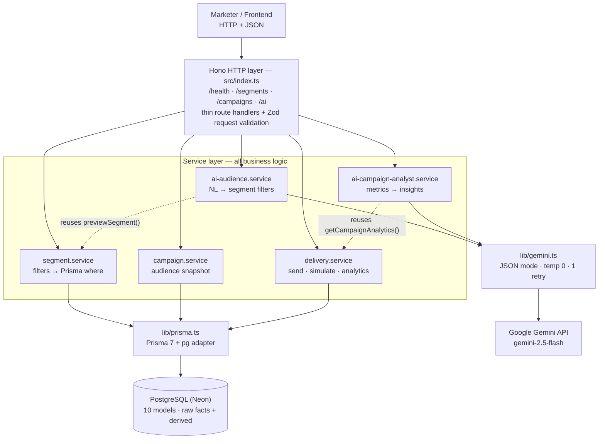
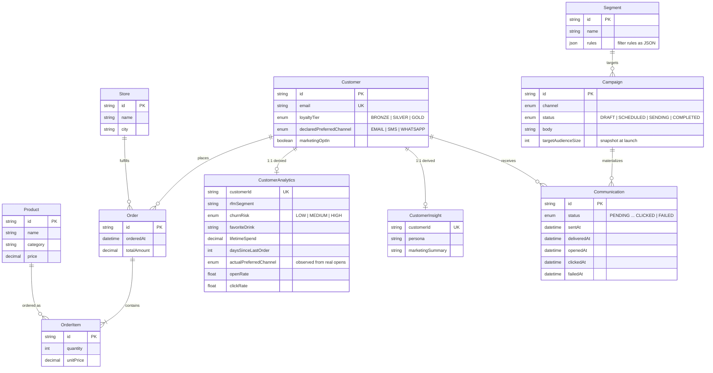
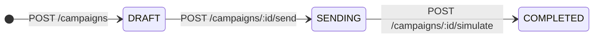
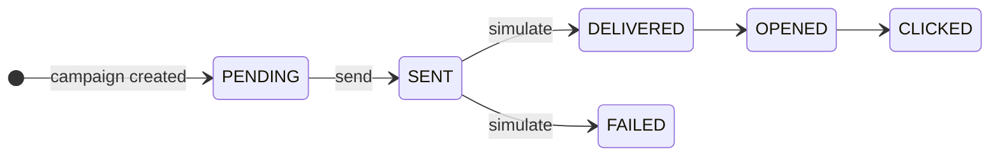
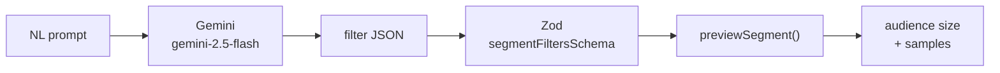
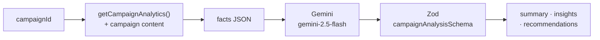
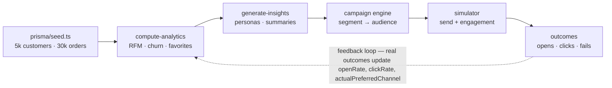

# barista-engage-api

Backend for Barista OS - an AI-native customer engagement platform for Barista Coffee. The backend covers the full marketing CRM loop: raw commerce data is distilled into per-customer intelligence, marketers (or AI) build audiences from it, campaigns materialize into per-customer communications, a deterministic simulator produces engagement outcomes, and those outcomes feed back into the analytics that drive the next campaign.

## Stack

- Hono (API framework)
- Prisma 7 + PostgreSQL (Neon)
- TypeScript + Zod
- Gemini 2.5 Flash via `@google/genai` (AI features)
- tsx for running scripts

## Backend architecture

Three strict layers: routes stay thin (parse + validate + map errors), services own all business logic, and one shared Prisma client touches the database. The two AI features are deliberately just **clients of the existing engines** - the model translates intent, it never queries data.



Solid arrows are in-process calls. Dashed arrows are the AI features reusing the exact same engines as the manual endpoints - no duplicated query or analytics logic anywhere.

## Data model

One rule governs the schema: **source tables store only raw facts**; everything derived (lifetime spend, RFM, churn risk, favorite drink, personas) lives in `CustomerAnalytics` / `CustomerInsight` and is recomputed from order and communication history - never duplicated back.



## Campaign lifecycle

Campaign status flow - launch uses an atomic claim (`updateMany where status = DRAFT`) so two concurrent sends can never both win. Audience size is snapshotted at creation.



Per-customer communication funnel - each stage gets its own timestamp. Simulation results are written in a single bulk `UPDATE ... FROM unnest()` (per-row updates blew Neon's transaction timeout at scale).



## API surface

| Method | Path | What it does |
|---|---|---|
| GET | `/health` | liveness check |
| POST | `/segments/preview` | count + top-20 sample for a filter set, nothing saved |
| POST | `/segments` | save reusable filter rules as a segment |
| GET | `/segments` | list saved segments |
| GET | `/segments/:id` | segment rules + live audience size (revalidates stored JSON) |
| POST | `/campaigns` | create campaign + one PENDING communication per matched customer, in one transaction |
| GET | `/campaigns` | list campaigns, newest first |
| GET | `/campaigns/:id` | campaign metadata, content, audience snapshot |
| GET | `/campaigns/:id/communications` | paginated per-customer records (limit/offset) |
| POST | `/campaigns/:id/send` | launch: DRAFT → SENDING, all communications → SENT |
| POST | `/campaigns/:id/simulate` | deterministic delivery + engagement simulation, → COMPLETED |
| GET | `/campaigns/:id/analytics` | funnel counts, rates, RFM segment breakdown |
| POST | `/ai/audience-builder` | natural language → validated filters → live audience preview |
| POST | `/ai/campaign-analyst` | campaign metrics → grounded summary, insights, recommendations |

## AI workflows

Both features follow one pattern: **facts in, validated JSON out**. The model never touches the database, never writes SQL, and its output always passes through the same strict Zod schemas as human input before anything else happens.

### AI Audience Builder



**POST /ai/audience-builder**

```json
{
  "prompt": "Find customers who love cold brew, haven't visited in 60 days, and spent more than 5000 rupees."
}
```

Response:

```json
{
  "generatedFilters": {
    "favoriteDrink": "Cold Brew",
    "daysSinceLastOrder": { "gt": 60 },
    "lifetimeSpend": { "gt": 5000 }
  },
  "audienceSize": 3,
  "sampleCustomers": ["..."]
}
```

Design notes:

- the model never touches the database and never writes SQL - it only emits filter JSON
- its output is validated by the **same** `segmentFiltersSchema` used by `POST /segments/preview` and `POST /segments`, so AI segments and manual segments share one implementation - no AI-specific filter logic exists
- the system prompt pins the allowed fields (`city`, `loyaltyTier`, `churnRisk`, `favoriteDrink`, `rfmSegment`, `lifetimeSpend`, `totalOrders`, `daysSinceLastOrder`), the five operators (`equals`, `gt`, `gte`, `lt`, `lte`), the exact catalog values (drink names, cities, rfm segments) and interpretation rules ("a month is 30 days", "high-value means lifetimeSpend > 5000")
- Gemini's `responseSchema` constrained decoding is deliberately NOT used - in testing it degraded translation quality (hallucinated filters, values on wrong fields); `responseMimeType: application/json` + strict Zod validation works reliably

### AI Campaign Analyst



**POST /ai/campaign-analyst**

```json
{
  "campaignId": "cmqaof2dp0000gg7kt1f73brf"
}
```

Response:

```json
{
  "campaign": { "id": "...", "name": "Cold Brew Second Chance", "channel": "WHATSAPP", "status": "COMPLETED" },
  "metrics": {
    "audienceSize": 167,
    "sent": 167,
    "delivered": 145,
    "failed": 22,
    "opened": 108,
    "clicked": 13,
    "deliveryRate": 86.8,
    "openRate": 74.5,
    "clickRate": 9,
    "clickToOpenRate": 12,
    "segmentBreakdown": { "At Risk": 76, "Lost Customer": 61, "Loyal Customer": 20, "Big Spender": 10 }
  },
  "analysis": {
    "summary": "2-4 sentence performance summary",
    "keyInsights": ["3 findings explaining why the campaign performed this way"],
    "recommendations": ["3 actionable next steps grounded in the data"]
  }
}
```

Design notes:

- no second analytics engine - the fact base is built from the same `getCampaignAnalytics()` used by `GET /campaigns/:id/analytics`, plus the campaign content (subject/body)
- the model only sees the supplied facts and is instructed to never invent numbers or claim unsupplied information (no revenue, no conversions)
- the system prompt includes platform context so the reasoning is grounded: typical per-channel open/delivery rates and what each rfm segment means, so "74.5% open on WhatsApp is on par, 9% click is well above the ~5% baseline" type conclusions are possible
- the analysis shape (`summary`, `keyInsights[]`, `recommendations[]`) is enforced by a strict Zod schema - invalid model output returns `422`, never reaches the client

Both AI features share one Gemini helper (`src/lib/gemini.ts`): `gemini-2.5-flash`, temperature 0, JSON mode, one retry on transient failures (but not on rate limits).

### AI error contract

| Status | Meaning |
|---|---|
| `400` | malformed request body or invalid prompt / campaignId |
| `404` | campaign not found (analyst only) |
| `422` | model output failed Zod validation, or the request can't be expressed with supported filters - details included |
| `429` | Gemini quota exhausted - surfaced cleanly, no wasted retries |
| `502` | Gemini unreachable after one automatic retry |
| `503` | `GEMINI_API_KEY` not configured |

Stack traces never leak.

## Delivery & engagement simulator

Not a coin flip. Every communication's outcome is computed from the customer's real analytics, and the RNG is seeded from `campaignId:customerId` (FNV-1a → mulberry32), so re-running a simulation always produces identical results. Timing is realistic too: delivery lands in 1-30s, opens skew toward the first hours with a ~48h tail, clicks come within ~30 minutes of an open.

### Channel base rates

| Channel | Delivery | Open | Click base |
|---|---|---|---|
| WHATSAPP | 98% | 75% | 5% |
| SMS | 97% | 55% | 5% |
| EMAIL | 95% | 35% | 5% |

### Behavioral modifiers

| Signal | Effect |
|---|---|
| Champion / Big Spender | +15% / +10% open, +10% / +8% click |
| At Risk / Lost Customer | −10% / −25% open |
| Preferred channel match | +10% open, +5% click |
| Lifetime spend ≥ ₹5,000 | +5% open |
| Persona: Deal Hunter | +20% click |
| Persona: Coffee Enthusiast | +10% click |

## Data pipeline & feedback loop



Run order: `db:seed` → `db:analytics` → `db:insights`. After campaigns run, run `db:analytics` again - past results make future targeting smarter. The effect is measurable: after the first campaign's outcomes were folded back into `CustomerAnalytics`, a second campaign on the same segment opened at 74.5% versus 68.7% the first time.

## Setup

```bash
npm install
```

Copy `.env.example` to `.env` and add your Postgres connection string plus your `GEMINI_API_KEY`.

Then generate the prisma client and apply migrations:

```bash
npx prisma generate
npx prisma migrate deploy
```

## Seeding

```bash
npm run db:seed
```

This creates the full dev dataset:

- 40 stores across 7 Indian cities
- 28 products (hot coffee, cold coffee, tea, food, desserts)
- 5000 customers
- 30000 orders with ~54k order items

The seed uses a seeded RNG so every run produces the exact same data.

## Analytics

```bash
npm run db:analytics
```

Builds the `CustomerAnalytics` table (one row per customer) from order history:

- spending metrics - lifetime spend, avg order value, total orders
- recency - last order date, days since last order
- favorite drink + favorite store
- RFM segments - Champion / Loyal Customer / Big Spender / At Risk / Lost Customer
- churn risk - LOW (ordered within 30 days), MEDIUM (31-60), HIGH (60+)

Safe to re-run anytime, it rebuilds the whole table.

The script also closes the feedback loop - it aggregates real campaign results from communications into `messagesSent`, `messagesOpened`, `messagesClicked`, `openRate`, `clickRate`, `lastCampaignInteractionAt`, and derives `actualPreferredChannel` from observed opens. Run it after campaigns to make future targeting smarter.

```bash
npm run db:insights
```

Populates `CustomerInsight` with a persona (Coffee Enthusiast, Deal Hunter, Premium Sipper, Lapsed Customer, etc.) and a marketing summary for every customer, rule-based from analytics. The delivery simulator uses these personas to modify click probabilities.

To eyeball the numbers:

```bash
npm run db:sanity
```

## Running the API

```bash
npm run dev
```

Starts the Hono server on http://localhost:3000.

### Endpoint details

**POST /segments/preview** - preview an audience before saving

```json
{
  "filters": {
    "churnRisk": "HIGH",
    "favoriteDrink": "Cold Brew",
    "lifetimeSpend": { "gt": 5000 }
  }
}
```

Returns `count` + up to 20 `sampleCustomers` (sorted by lifetime spend).

**POST /segments** - save a reusable segment

```json
{
  "name": "High Value Cold Brew Lovers",
  "rules": { "churnRisk": "HIGH", "lifetimeSpend": { "gt": 5000 } }
}
```

**GET /segments** - list all segments (id, name, createdAt)

**GET /segments/:id** - segment metadata + rules + live `audienceSize`

#### Supported filters (v1)

- customer fields - `city`, `loyaltyTier`
- analytics fields - `churnRisk`, `favoriteDrink`, `rfmSegment`, `lifetimeSpend`, `totalOrders`, `daysSinceLastOrder`
- numeric fields take either a plain number or `{ equals, gt, gte, lt, lte }`

Unknown fields, bad operators and malformed payloads get rejected with a 400 and a list of what's wrong.

**POST /campaigns** - create a campaign from a saved segment

```json
{
  "name": "Win Back Cold Brew Lovers",
  "segmentId": "segment-id",
  "channel": "WHATSAPP",
  "subject": "Your Cold Brew misses you",
  "body": "Come back this weekend and enjoy 20% off"
}
```

Snapshots the audience size and creates one PENDING communication per matched customer, all inside a single transaction. Returns `campaignId`, `targetAudienceSize`, `communicationsCreated` and `status`.

**GET /campaigns** - all campaigns, newest first

**GET /campaigns/:id** - campaign metadata + content + audience snapshot

**GET /campaigns/:id/communications** - communication records with `limit` (default 50, max 200) and `offset` pagination

**POST /campaigns/:id/send** - launch a DRAFT campaign, flips it to SENDING and marks every communication SENT

**POST /campaigns/:id/simulate** - runs the delivery + engagement simulator. outcomes are driven by customer analytics (rfm segment, churn risk, preferred channel, lifetime spend, persona) and channel base rates, not plain randomness. deterministic - seeded by campaignId + customerId so reruns give identical results. flips the campaign to COMPLETED.

**GET /campaigns/:id/analytics** - aggregated performance: sent / delivered / failed / opened / clicked counts, deliveryRate, openRate, clickRate, clickToOpenRate and an rfm segment breakdown of the audience

## Project structure

```
src/
  index.ts            # hono server entry
  routes/             # route handlers, thin layer (segments, campaigns, delivery, ai)
  services/           # business logic + query building (incl. the two ai services)
  validators/         # zod schemas for request + ai output validation
  lib/prisma.ts       # shared prisma client
  lib/gemini.ts       # shared gemini helper (json mode, temp 0, retry)
prisma/
  schema.prisma       # the data model
  seed.ts             # dev seed script
  migrations/         # migration history
scripts/
  compute-analytics.ts  # builds CustomerAnalytics
  generate-insights.ts  # builds CustomerInsight personas
  sanity-checks.ts      # quick queries to verify the data looks right
  verify-counts.ts      # row counts
  list-tables.ts        # lists db tables
```

## Design principles

- **Correctness over cleverness** - atomic status claims prevent double-sends, stored segment JSON is revalidated on every read (corrupt rows surface as clean 422s, not crashes), campaign + communications are created in one transaction.
- **Determinism everywhere** - seed data, analytics, personas and simulation outcomes are all reproducible. No `Math.random` anywhere; every random-looking number traces back to a seeded hash.
- **AI as a client, not an oracle** - both AI features call the same service functions the manual endpoints use. The model translates intent and explains data; validation and querying stay in deterministic code.
- **Derived data stays derived** - analytics tables can be wiped and rebuilt from source facts at any time. Nothing computed is ever written back into a source table.
