# barista-engage-api

Backend for **Barista Engage** — an AI-native customer engagement platform for Barista Coffee.

The API powers the full marketing CRM loop: commerce data becomes per-customer intelligence, marketers describe a business goal in natural language, AI builds an audience, **Campaign Studio** turns that audience into a complete campaign (strategy, copy, creative), campaigns materialize into per-customer communications, a deterministic simulator produces engagement outcomes, and those outcomes feed back into the analytics that drive the next campaign.

**Frontend:** [`barista-engage-web`](../barista-engage-web) (separate repo; CORS origin from `FRONTEND_URL`, defaults to `http://localhost:5173` in dev).

---

## Table of contents

1. [Marketer workflow](#marketer-workflow)
2. [System context](#system-context)
3. [Stack](#stack)
4. [Architecture](#architecture)
5. [Audience Builder pipeline](#audience-builder-pipeline)
6. [ROI forecast engine](#roi-forecast-engine)
7. [Campaign Studio pipeline](#campaign-studio-pipeline)
8. [Save and launch](#save-and-launch)
9. [API surface](#api-surface)
10. [Frontend integration contract](#frontend-integration-contract)
11. [Data model](#data-model)
12. [Campaign lifecycle](#campaign-lifecycle)
13. [AI and error contract](#ai-and-error-contract)
14. [Delivery and engagement simulator](#delivery-and-engagement-simulator)
15. [Data pipeline and feedback loop](#data-pipeline-and-feedback-loop)
16. [Setup](#setup)
17. [Deployment](#deployment)
18. [Tests](#tests)
19. [Supported segment filters](#supported-segment-filters-v1)
20. [Project structure](#project-structure)
21. [Design principles](#design-principles)

---

## Marketer workflow

This is the primary product journey the API is built around:

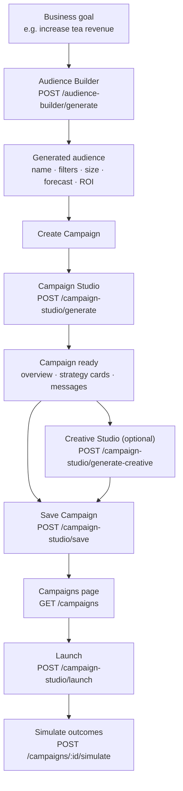

| Step | Question answered | Primary endpoint |
|------|-------------------|------------------|
| Audience Builder | **Who** should I target? | `POST /audience-builder/generate` |
| Campaign Studio | **What** campaign should I run for them? | `POST /campaign-studio/generate` |
| Creative Studio | **What visual** should accompany the campaign? | `POST /campaign-studio/generate-creative` |
| Save | Persist a real draft campaign | `POST /campaign-studio/save` |
| Campaigns list | Show saved campaigns | `GET /campaigns` |
| Launch + simulate | Send and measure outcomes | `POST /campaign-studio/launch` → `POST /campaigns/:id/simulate` |

---

## System context

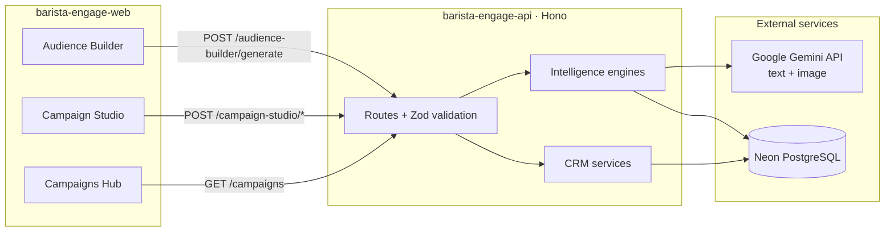

---

## Stack

| Layer | Technology |
|-------|------------|
| API | Hono + `@hono/node-server` |
| Runtime | Node.js + tsx |
| Database | Prisma 7 + PostgreSQL (Neon) |
| Validation | TypeScript + Zod |
| AI (text) | `gemini-2.5-flash` via `@google/genai` |
| AI (images) | `gemini-2.5-flash-image` via `@google/genai` |
| Tests | Node.js built-in test runner |

---

## Architecture

Three strict layers: routes stay thin (parse + validate + map errors), services own all business logic, and one shared Prisma client touches the database. AI features are **clients of existing engines** — the model translates intent or generates copy; deterministic code owns queries, forecasts, and validation.

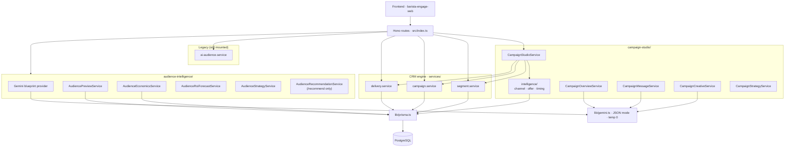

### Request flow pattern

Every route follows the same contract:

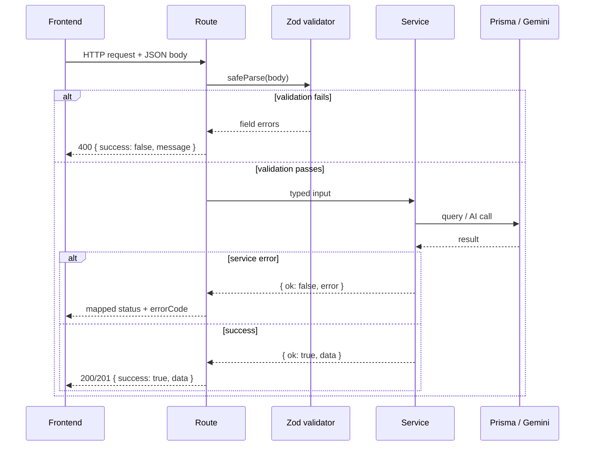

---

## Audience Builder pipeline

**Answers:** *Who should I target?*

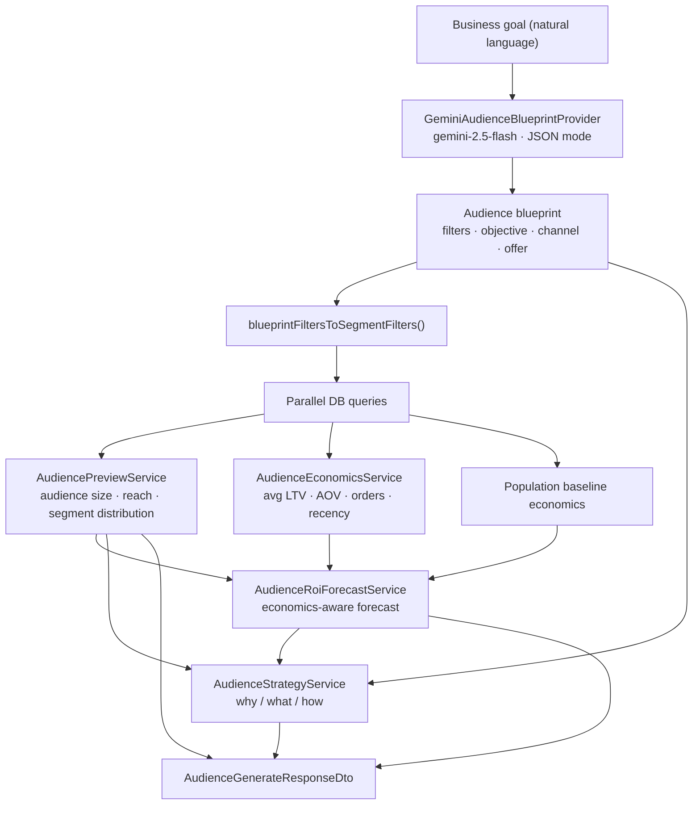

**POST /audience-builder/generate**

```json
{ "goal": "I want to increase tea product revenue." }
```

**Response (abbreviated):**

```json
{
  "goal": "I want to increase tea product revenue.",
  "generatedAudience": {
    "name": "Tea Loyalists",
    "description": "Customers who frequently purchase tea products.",
    "filters": [{ "field": "favoriteDrink", "operator": "equals", "value": "Masala Chai" }]
  },
  "audiencePreview": { "audienceSize": 500, "estimatedReach": 490 },
  "forecast": {
    "expectedOpenRate": 78,
    "expectedCtr": 9,
    "expectedRevenueImpact": { "min": 1400, "max": 1960 },
    "roi": 1.6
  },
  "strategy": {
    "why": "This audience aligns with a tea revenue goal…",
    "what": "Reaching 490 of 500 customers could drive…",
    "how": "Target via WhatsApp with Double Loyalty Points…"
  },
  "recommendedChannel": "WhatsApp",
  "recommendedOffer": "Double Loyalty Points",
  "confidence": 0.91
}
```

> **Note:** `POST /audience-builder/recommend` uses a separate, older `AudienceForecastService` with fixed average order value. The primary workflow uses `/generate` and its economics-aware ROI engine.

---

## ROI forecast engine

`/audience-builder/generate` uses `AudienceRoiForecastService`, which reflects **audience-specific economics** from `CustomerAnalytics` — not fixed assumptions when real data exists.

### Inputs (from database)

| Metric | Source |
|--------|--------|
| `averageLifetimeSpend` | `CustomerAnalytics` aggregation for filtered audience |
| `averageOrderValue` | `CustomerAnalytics` aggregation |
| `averageOrdersPerCustomer` | `CustomerAnalytics` aggregation |
| `averageDaysSinceLastOrder` | Recency proxy (churn is not used directly) |
| Population baseline | Same metrics across all customers |

### Quality multipliers (audience vs population)

| Multiplier | Driven by | Affects |
|------------|-----------|---------|
| `responseMultiplier` | Recency (`populationDays / audienceDays`) | Open rate, CTR |
| `conversionMultiplier` | Order frequency × spend ratio | Conversions |
| `revenueMultiplier` | Spend ratio × order value ratio | Revenue per conversion |

### Formula

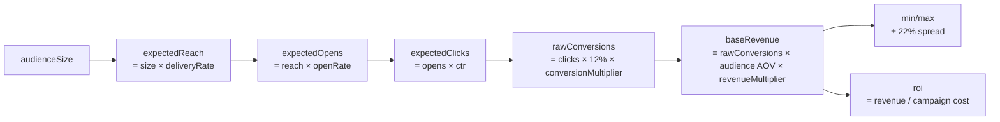

Fixed constants still used: `CLICK_TO_PURCHASE_RATE = 12%`, channel delivery/open/CTR benchmarks, `CAMPAIGN_SETUP_COST_INR = 500`, per-message costs.

Open rate capped at **95%**, CTR capped at **22%**. Small audiences may round to **0 conversions** due to `Math.round`.

---

## Campaign Studio pipeline

**Answers:** *What campaign should I run for this audience?*

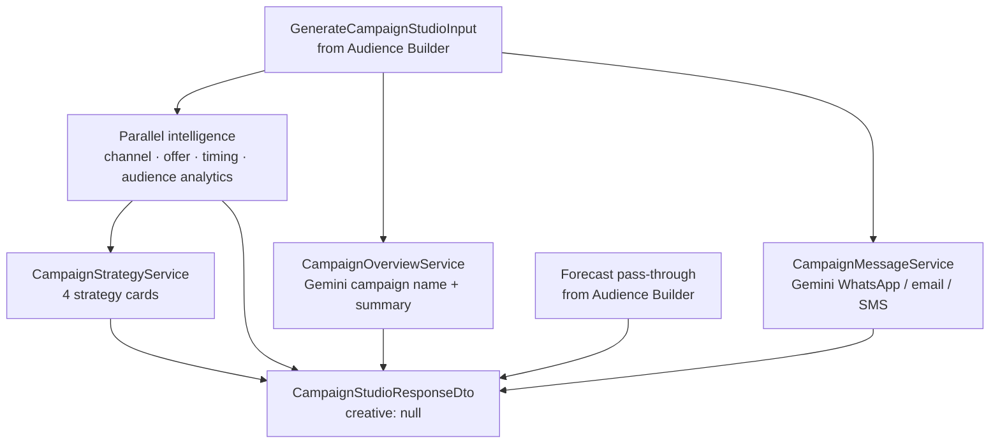

Campaign Studio combines three layers:

1. **Deterministic intelligence** — channel, offer, and timing recommendations from real audience analytics (`campaign-studio/intelligence/`)
2. **Gemini (text)** — campaign overview and multi-channel message copy (with deterministic fallbacks on AI failure)
3. **Gemini (images)** — marketing creative on demand via separate endpoint

Forecast numbers come from Audience Builder — **not regenerated by AI**.

### Generate full campaign

**POST /campaign-studio/generate** — see [Frontend integration contract](#frontend-integration-contract) for the exact request shape.

**Response sections:**

| Section | Source | Example |
|---------|--------|---------|
| `overview` | Gemini (fallback: deterministic) | `Tea Loyalty Boost 2026` · objective · summary |
| `strategy.cards[]` | Deterministic | Four cards: audience, offer, channel, timing |
| `recommendations` | Deterministic | Channel, offer, timing + reasoning arrays |
| `forecast` | Passed-through from Audience Builder | Reach, open rate, CTR, revenue, ROI |
| `message` | Gemini (fallback: deterministic) | WhatsApp, email subject/body, SMS |
| `creative` | `null` until generated separately | — |

**Strategy card shape** (designed for frontend card UI):

```json
{
  "id": "audience",
  "title": "Why This Audience",
  "headline": "Tea Loyalists",
  "highlight": "500 customers",
  "points": ["This audience aligns with tea revenue goals.", "..."]
}
```

Card IDs: `audience` · `offer` · `channel` · `timing`

### Message generation

| Endpoint | Purpose |
|----------|---------|
| `POST /campaign-studio/generate-message` | Initial Gemini copy |
| `POST /campaign-studio/regenerate-message` | Fresh copy (optionally pass edited `message`) |

### Creative generation

| Endpoint | Purpose |
|----------|---------|
| `POST /campaign-studio/generate-creative` | Gemini image model marketing visual |
| `POST /campaign-studio/regenerate-creative` | Fresh composition / lighting |

Model: `gemini-2.5-flash-image` via `generateContent` with `responseModalities: ["IMAGE", "TEXT"]`.

Returns `{ "imageUrl": "data:image/png;base64,...", "imagePrompt": "..." }`.

Requires `GEMINI_API_KEY` with image generation quota. The frontend can hide creative generation via `VITE_ENABLE_CAMPAIGN_CREATIVE=false` when quota is exhausted.

---

## Save and launch

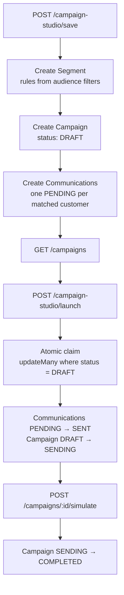

**POST /campaign-studio/save** creates:

1. **Segment** from audience filters
2. **Campaign** (status `DRAFT`) with channel-appropriate body + optional creative
3. **Communications** — one `PENDING` record per matched customer

```json
{
  "segmentId": "seg-uuid",
  "campaign": {
    "id": "camp-uuid",
    "name": "Tea Loyalty Boost 2026",
    "status": "DRAFT",
    "audienceSize": 500,
    "channel": "WHATSAPP",
    "createdAt": "2026-06-15T10:00:00.000Z"
  },
  "communicationsCreated": 500
}
```

**POST /campaign-studio/launch**

```json
{ "campaignId": "camp-uuid" }
```

Equivalent to `POST /campaigns/:id/send`. Only `DRAFT` campaigns can be launched. Status becomes **`SENDING`** (not `ACTIVE`). All linked communications move to `SENT`.

> Each save creates a **new segment**. There is no deduplication — repeated saves from the same audience produce duplicate segments.

---

## API surface

All successful responses use `{ "success": true, "data": ... }`.

Errors use `{ "success": false, "message": "...", "errorCode": "..." }` on campaign-studio AI routes. Other routes return `message` only.

### Health

| Method | Path | Description |
|--------|------|-------------|
| GET | `/health` | Liveness check → `{ "status": "ok" }` |

### Segments

| Method | Path | Description |
|--------|------|-------------|
| POST | `/segments/preview` | Count + sample customers for a filter set (nothing saved) |
| POST | `/segments` | Save reusable filter rules as a segment |
| GET | `/segments` | List saved segments |
| GET | `/segments/:id` | Segment rules + live audience size |

### Campaigns and delivery

| Method | Path | Description |
|--------|------|-------------|
| POST | `/campaigns` | Create campaign + one PENDING communication per matched customer |
| GET | `/campaigns` | List campaigns, newest first |
| GET | `/campaigns/:id` | Campaign metadata, content, audience snapshot |
| GET | `/campaigns/:id/communications` | Paginated per-customer records |
| POST | `/campaigns/:id/send` | Launch: DRAFT → SENDING |
| POST | `/campaigns/:id/simulate` | Deterministic delivery + engagement simulation → COMPLETED |
| GET | `/campaigns/:id/analytics` | Funnel counts, rates, RFM breakdown |

### Audience Builder

| Method | Path | Description |
|--------|------|-------------|
| POST | `/audience-builder/generate` | **Primary.** AI-generated audience from a business goal (Gemini + DB preview + economics-aware ROI) |
| POST | `/audience-builder/recommend` | Recommend best saved segment for a goal (no Gemini; older forecast engine) |
| POST | `/audience-builder/analyze` | Deprecated alias of `/recommend` |

### Campaign Studio

| Method | Path | Description |
|--------|------|-------------|
| POST | `/campaign-studio/generate` | Full campaign: overview + strategy cards + forecast + Gemini messages |
| POST | `/campaign-studio/generate-message` | Gemini copy only (WhatsApp, email, SMS) |
| POST | `/campaign-studio/regenerate-message` | Fresh message copy (pass edited copy to vary output) |
| POST | `/campaign-studio/generate-creative` | Gemini image marketing visual |
| POST | `/campaign-studio/regenerate-creative` | Fresh visual variation |
| POST | `/campaign-studio/save` | Create segment + DRAFT campaign (appears on `GET /campaigns`) |
| POST | `/campaign-studio/launch` | Send a saved DRAFT campaign → SENDING |

### Legacy AI

| Method | Path | Description |
|--------|------|-------------|
| POST | `/ai/audience-builder` | NL prompt → segment filters → preview (older contract) |

---

## Frontend integration contract

The frontend (`barista-engage-web`) must map Audience Builder output before calling Campaign Studio. Raw Audience Builder responses will fail Zod validation on `/campaign-studio/generate`.

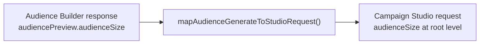

### Field mapping

| Audience Builder | Campaign Studio |
|------------------|-----------------|
| `audiencePreview.audienceSize` | `audienceSize` |
| `audiencePreview.estimatedReach` | `forecast.expectedReach` |
| `forecast.expectedRevenueImpact` | `forecast.expectedRevenueImpact` |
| `forecast.roi` | `forecast.roi` |
| `generatedAudience` | `generatedAudience` |
| `strategy` | `strategy` |

### Response envelope

Always read `response.data`, not the top-level object:

```json
{ "success": true, "data": { ... } }
```

### Forecast field rename in Campaign Studio response

| Audience Builder | Campaign Studio response |
|------------------|------------------------|
| `forecast.expectedRevenueImpact` (min/max) | `forecast.expectedRevenue` (single midpoint) |
| `forecast.roi` | `forecast.expectedRoi` |

### Launch status

Backend returns `SENDING` after launch. The frontend should display **"Sending"**, not `"ACTIVE"`. Full lifecycle: `DRAFT` → `SENDING` → `COMPLETED` (after simulate).

### Creative feature flag

```env
# barista-engage-web/.env
VITE_ENABLE_CAMPAIGN_CREATIVE=false   # hide when Gemini image quota exhausted
VITE_API_BASE_URL=/api                # dev proxy only; use full URL in production
```

---

## Data model

One rule governs the schema: **source tables store only raw facts**; everything derived (lifetime spend, RFM, churn risk, favorite drink, personas) lives in `CustomerAnalytics` / `CustomerInsight` and is recomputed from order and communication history — never duplicated back.

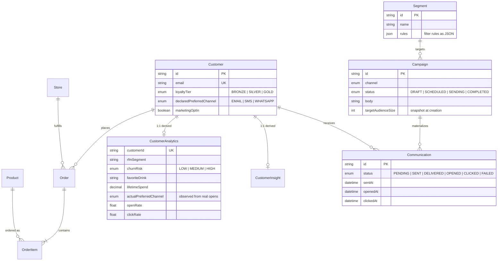

---

## Campaign lifecycle

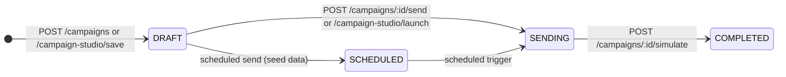

Launch uses an atomic claim (`updateMany where status = DRAFT`) so two concurrent sends can never both win. Audience size is snapshotted at creation.

---

## AI and error contract

### Models

| Use case | Model | Config |
|----------|-------|--------|
| Audience blueprint | `gemini-2.5-flash` | JSON mode, temperature 0, one retry |
| Campaign overview + messages | `gemini-2.5-flash` | JSON mode, temperature 0, one retry |
| Campaign creative | `gemini-2.5-flash-image` | `responseModalities: ["IMAGE", "TEXT"]` |

Shared text helper: `src/lib/gemini.ts`. Stack traces never leak to clients.

### HTTP status codes

| Status | Meaning |
|--------|---------|
| `400` | Malformed request body or validation failure |
| `402` | Image generation requires paid Gemini plan |
| `404` | Resource not found (segment, campaign) |
| `422` | Model output failed Zod validation, or invalid segment rules |
| `429` | Gemini quota exhausted |
| `500` | Internal error or `GEMINI_API_KEY` not configured |
| `503` | Image model unavailable |

### Error codes (campaign-studio AI routes)

| errorCode | HTTP | When |
|-----------|------|------|
| `CONFIGURATION_ERROR` | 500 | `GEMINI_API_KEY` not set |
| `RATE_LIMITED` | 429 | Gemini quota exhausted |
| `MODEL_UNAVAILABLE` | 500/503 | Model not found or unreachable |
| `PAID_PLAN_REQUIRED` | 402 | Image generation on paid plan only |
| `INVALID_PAYLOAD` | 500 | Unmapped service error |

Example:

```json
{
  "success": false,
  "message": "ai quota exceeded, wait a minute and try again",
  "errorCode": "RATE_LIMITED"
}
```

---

## Delivery and engagement simulator

Not a coin flip. Every communication's outcome is computed from the customer's real analytics, and the RNG is seeded from `campaignId:customerId` (FNV-1a → mulberry32), so re-running a simulation always produces identical results.

### Channel base rates

| Channel | Delivery | Open | Click base |
|---------|----------|------|------------|
| WHATSAPP | 98% | 75% | 5% |
| SMS | 97% | 55% | 5% |
| EMAIL | 95% | 35% | 5% |

### Behavioral modifiers

| Signal | Effect |
|--------|--------|
| Champion / Big Spender | +15% / +10% open, +10% / +8% click |
| At Risk / Lost Customer | −10% / −25% open |
| Preferred channel match | +10% open, +5% click |
| Lifetime spend ≥ ₹5,000 | +5% open |
| Persona: Deal Hunter | +20% click |
| Persona: Coffee Enthusiast | +10% click |

---

## Data pipeline and feedback loop

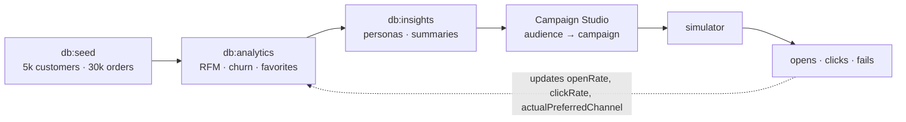

Run order: `db:seed` → `db:analytics` → `db:insights`. After campaigns run, run `db:analytics` again — past results make future targeting smarter.

### Utility scripts

| Script | Purpose |
|--------|---------|
| `scripts/compute-analytics.ts` | Rebuild `CustomerAnalytics` from orders |
| `scripts/generate-insights.ts` | Rebuild `CustomerInsight` personas |
| `scripts/sanity-checks.ts` | Data integrity checks |
| `scripts/compare-audience-forecasts.ts` | Compare ROI across segment types |
| `scripts/audit-save-launch.ts` | Verify save + launch workflow |
| `scripts/test-creative-generate.ts` | Live test image generation |

---

## Setup

```bash
npm install
```

Copy `.env.example` to `.env` and set:

```env
DATABASE_URL=postgresql://...
GEMINI_API_KEY=your-key
PORT=3000
```

Then:

```bash
npx prisma generate
npx prisma migrate deploy
npm run db:seed
npm run db:analytics
npm run db:insights
```

### Running locally

**API:**

```bash
npm run dev
```

Server starts at http://localhost:3000.

**Frontend** (separate repo):

```bash
cd ../barista-engage-web
npm install
npm run dev
```

Frontend dev server: http://localhost:5173 (proxies `/api` → `http://localhost:3000`).

---

## Deployment

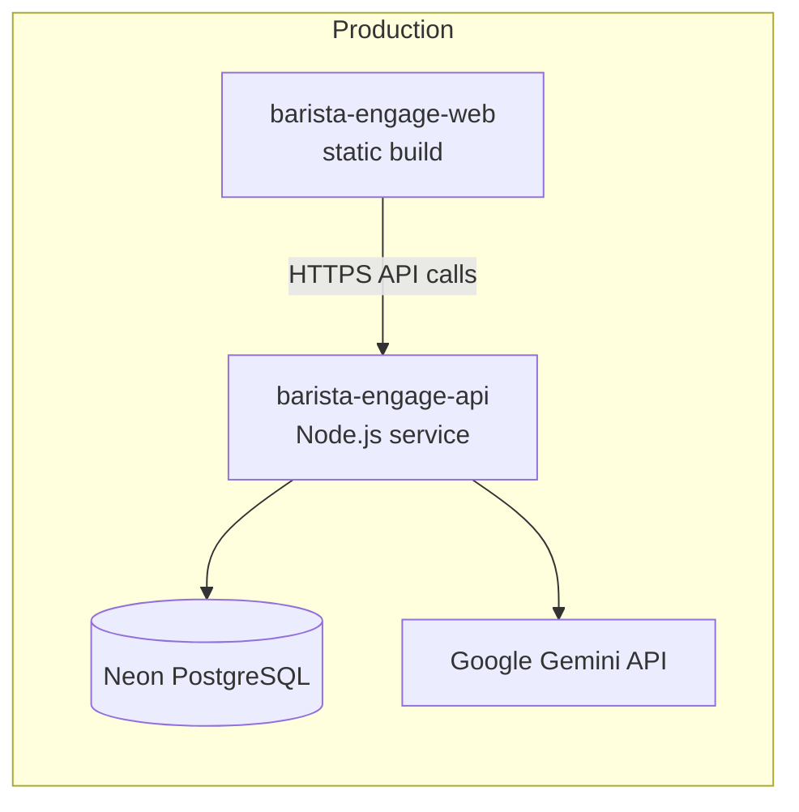

### API environment variables

| Variable | Required | Notes |
|----------|----------|-------|
| `DATABASE_URL` | Yes | Neon connection string with SSL |
| `GEMINI_API_KEY` | Yes | AI features |
| `PORT` | Auto | Set by hosting platform |
| `FRONTEND_URL` | Yes | Production frontend origin for CORS |

### Frontend environment variables (build time)

| Variable | Required | Notes |
|----------|----------|-------|
| `VITE_API_BASE_URL` | Yes | Full API URL in production, e.g. `https://api.yourdomain.com` |
| `VITE_ENABLE_CAMPAIGN_CREATIVE` | Optional | `false` to hide image generation when quota exhausted |

### Deploy on Render

`render.yaml` in the repo root defines the web service:

| Setting | Value |
|---------|-------|
| `buildCommand` | `npm install && npx prisma generate && npm run build` |
| `startCommand` | `npm start` → `node dist/index.js` |
| `healthCheckPath` | `/health` |

`esbuild` is a **production dependency** so `npm run build` works when Render omits devDependencies.

**Prisma migrations (Free Tier):** `render.yaml` does not auto-run migrations. Apply schema once from your machine or the Render Shell:

```bash
DATABASE_URL="your-neon-url" npx prisma migrate deploy
```

If the production database is empty after migrate:

```bash
npm run db:seed && npm run db:analytics && npm run db:insights
```

### Deploy steps

**1. API (Render)** in Render to your deployed frontend URL (e.g. `https://barista-engage-web.onrender.com`).

**3. Frontend**

```bash
# Set VITE_API_BASE_URL before build
npm run build
# Deploy dist/ to static host
```

**4. Verify**

```bash
curl https://your-api/health
# → { "status": "ok" }
```

End-to-end smoke test: Audience Builder → Campaign Studio → Save → Launch → check `GET /campaigns`.

### Demo day tips

- Use fresh Gemini quota; avoid stress testing right before demo
- Keep `VITE_ENABLE_CAMPAIGN_CREATIVE=false` until image quota resets
- Launch status shows **Sending** (`SENDING`), not Active
- Generate only 2–3 campaigns during demo

---

## Tests

```bash
npm test
```

32 tests covering audience intelligence, campaign studio routes, strategy cards, ROI forecast, preview scoping, and intelligence services.

---

## Supported segment filters (v1)

| Field | Type | Notes |
|-------|------|-------|
| `city` | string | |
| `loyaltyTier` | `BRONZE` · `SILVER` · `GOLD` | |
| `churnRisk` | `LOW` · `MEDIUM` · `HIGH` | analytics |
| `favoriteDrink` | string | analytics |
| `rfmSegment` | Champion · Loyal Customer · Big Spender · At Risk · Lost Customer | analytics |
| `lifetimeSpend` | number or `{ gt, gte, lt, lte, equals }` | analytics |
| `totalOrders` | number or operators | analytics |
| `daysSinceLastOrder` | number or operators | analytics |

Unknown fields and bad operators are rejected with `400` and field-level error messages.

---

## Project structure

```
src/
  index.ts                          # Hono entry · route mounting · CORS
  routes/
    audience-builder.ts             # /audience-builder/*
    campaign-studio.ts              # /campaign-studio/*
    segments.ts · campaigns.ts · delivery.ts
    ai.ts                           # legacy AI endpoints
  audience-intelligence/
    providers/                      # Gemini blueprint · rule-based intent
    services/                       # preview · economics · ROI · strategy · recommend
    dto/ · constants/ · utils/ · types/
  campaign-studio/
    intelligence/                   # channel · offer · timing · audience analytics
    services/                       # overview · strategy · message · creative · orchestrator
    dto/ · constants/ · container.ts
  services/                         # segment · campaign · delivery · legacy AI
  validators/                       # Zod request schemas
  lib/prisma.ts · lib/gemini.ts · lib/response.ts
  types/dto.ts                      # frontend-facing DTO mappers
  middleware/request-logger.ts
prisma/                             # schema · migrations · seed
scripts/                            # analytics · insights · audit helpers
tests/                              # route + service tests
```

---

## Design principles

- **Correctness over cleverness** — atomic status claims prevent double-sends; stored segment JSON is revalidated on every read; campaign + communications are created in one transaction.
- **Determinism everywhere** — seed data, analytics, personas, forecasts, and simulation outcomes are reproducible.
- **AI as a client, not an oracle** — Gemini generates blueprints, copy, and creatives; Zod validates every AI output; queries and forecasts stay in deterministic code.
- **Two-step marketer journey** — Audience Builder answers *who*; Campaign Studio answers *what*.
- **Derived data stays derived** — analytics tables can be wiped and rebuilt from source facts at any time.
- **Economics-aware forecasting** — revenue forecasts reflect audience-specific LTV, AOV, order frequency, and recency — not fixed assumptions when real data exists.
